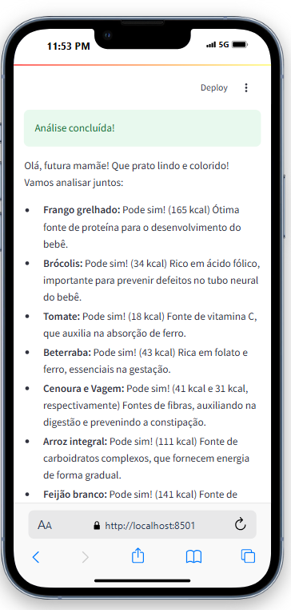
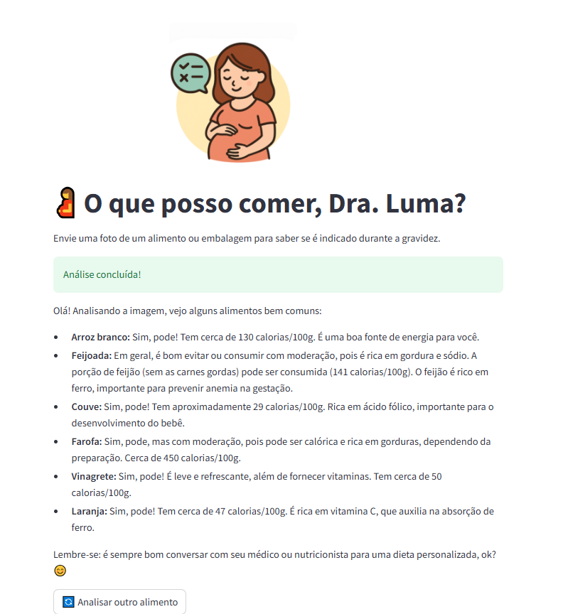

# 🍼 Alimentação na Gravidez — com Dra. Gema

**Uma IA gentil para ajudar gestantes a saberem o que podem (ou não) comer.**  
Inspirado na minha esposa, que está grávida e vive a dúvida diária: *“Será que posso comer isso?”*

A ideia foi desenvolvida como parte do desafio proposto durante a Imersão de IA com o Google Gemini, promovida pela Alura em parceria com o Google durante a edição de 2025.

---

## 👶 Sobre o projeto

Esse aplicativo foi criado com muito carinho para oferecer mais segurança e acolhimento durante a gestação.

Basta enviar uma foto de um **alimento** (ou da **embalagem**) e a **Dra. Gema**, nossa IA nutricionista empática, irá:

- ✅ Dizer se é indicado ou não na gravidez  
- 🔥 Estimar as calorias por 100g ou 100ml  
- 💚 Apontar benefícios para a gestação, se houver  

A linguagem é sempre direta, acolhedora e pensada para o momento sensível da gravidez.

---

## 🚀 Teste o App

Acesse o **Luma Gestante** diretamente pelo navegador:

Via Render
- 👉 [https://lumagestante.onrender.com/](https://lumagestante.onrender.com/)
Via StreamLit App
- 👉 [https://lumagestante.streamlit.app/](https://lumagestante.streamlit.app/)

---

## 🧪 Tecnologias Utilizadas

- **[Streamlit](https://streamlit.io/)** – Framework para criação rápida de interfaces web em Python  
- **[Google Gemini API](https://ai.google.dev/)** – Para geração de respostas inteligentes com base nas imagens alimentares enviadas  
- **[Pillow (PIL)](https://pillow.readthedocs.io/)** – Manipulação e redimensionamento de imagens  
- **[dotenv](https://pypi.org/project/python-dotenv/)** – Para gerenciamento seguro das variáveis de ambiente  

---

## 🚀 Como usar localmente

Clone o repositório e instale as dependências:

```bash
git clone https://github.com/flimaz/LumaGestante.git
cd LumaGestante
pip install -r requirements.txt
```

## 🖼️ Visual do aplicativo

### Celular


### Desktop


---

## 🙌 Contribuições

Contribuições são bem-vindas! Você pode abrir uma issue ou enviar um pull request com melhorias, correções ou novas ideias.

---

## ❤️ Agradecimentos

Projeto idealizado com amor para todas as mamães que possuem dúvidas sobre o que comer.